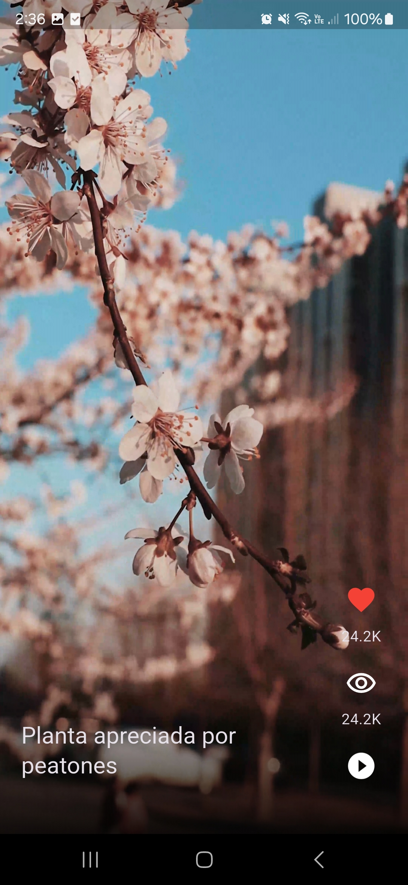

# toktik

## A new Flutter project.

### In this app we will going to watch videos, using an app similar to tiktok...
<b> Notes: </b> <i>In this moment this project is using local videos</i>

<table style="border-collapse: collapse; border: none;">
  <tr>
    <td style="padding: 8px;">  </td>
    <td style="padding: 8px;">Row 1, Column 2</td>
    <td style="padding: 8px;">Row 1, Column 2</td>
  </tr>
  
</table>

## Getting Started

This project is a starting point for a Flutter application.

A few resources to get you started if this is your first Flutter project:

- [Learn Flutter](https://docs.flutter.dev/get-started/learn-flutter)
- [Write your first Flutter app](https://docs.flutter.dev/get-started/codelab)
- [Flutter learning resources](https://docs.flutter.dev/reference/learning-resources)

For help getting started with Flutter development, view the
[online documentation](https://docs.flutter.dev/), which offers tutorials,
samples, guidance on mobile development, and a full API reference.
